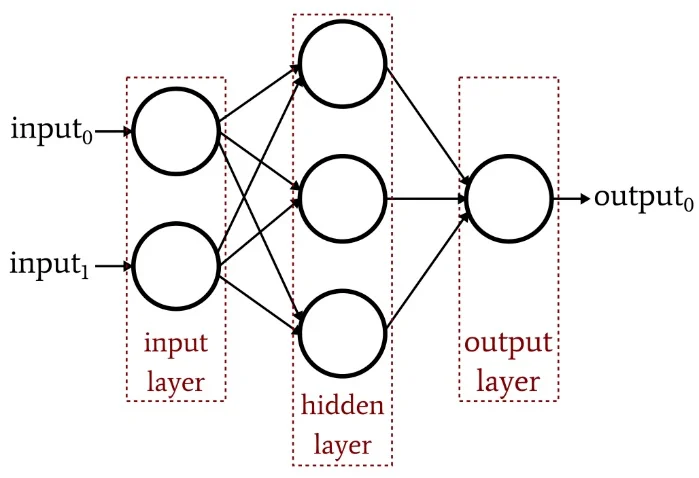
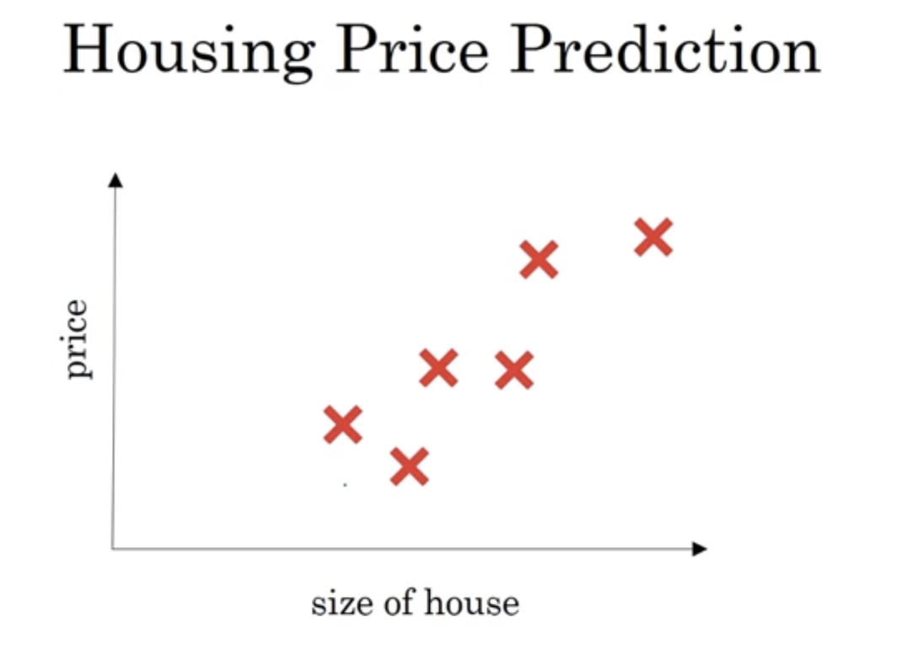
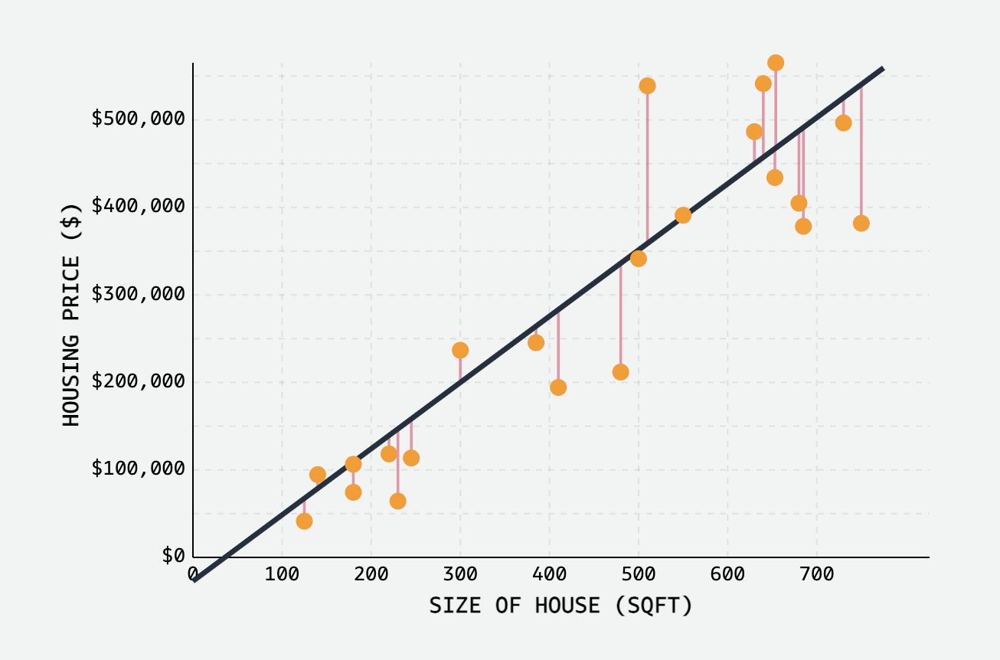
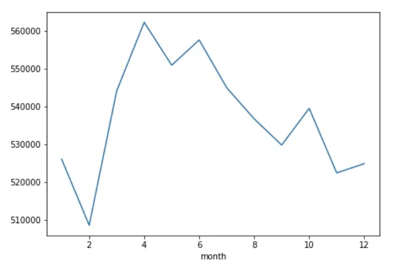

# Main idea behind Deep Learning

In deep learning, we essentially design a function (a deep neural network) that takes an input (e.g., an image) and produces an output (e.g., a label like "cat" or "dog").

  

1. Initially, the function (network) produces incorrect outputs because the parameters (weights) are not yet trained, they are random.
2. Training involves feeding the function labeled data (input-output pairs) and adjusting the weights using algorithms like gradient descent to minimize the error between predicted and actual outputs.
3. The goal is to train the function to generalize well, meaning it should also provide accurate outputs on unseen (test) data that was not used during training.

This process enables the network to learn patterns and make predictions for new, unknown data.

## Neural Networks

At the core of deep learning are neural networks, which are like computer systems modeled after how the brain works. They are made up of layers of tiny units called neurons that are connected to each other. These neurons work together to process data, learn patterns, and make predictions. It includes:-
- Input Layer: The first layer, which receives raw data (e.g., pixel values of an image).
- Hidden Layers: Layers between the input and output layers that process the data through transformations.
- Output Layer: Produces the final prediction or decision, such as classifying an image or predicting a value

  

## Linear Regression Vs Neural Networks

Let's take the problem of housing price prediction. Let's see how these two different models tackle this problem in their own way. 

  

### Linear Regression 

- Objective: Predict a continuous hosing price value based on a linear relationship with input features (e.g., square footage, number of bedrooms).   
- How it works: Finds the "best fit" straight line through the data points. This line represents the linear relationship between the features and the price.
- Limitations: Assumes a linear relationship, which may not always be true for house prices.

  

### Neural Networks (NNs)

- Objective: Predict a continuous value (house price) with a non-linear relationships between features and the target.
- How it works: Consists of interconnected layers of nodes (neurons) that process information. Each connection has a weight, and the network learns these weights during training to make accurate predictions. NNs can learn very complex patterns in the data.   
- Advantages: Can model complex non-linear relationships, handle many features, and often achieve high accuracy.

  

