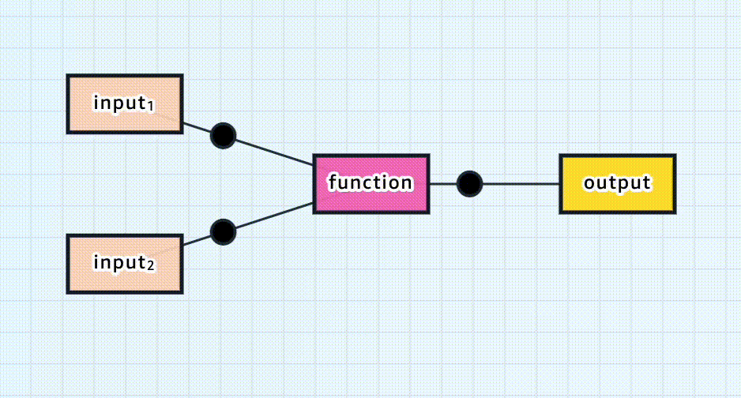

# Main idea behind Deep Learning

In deep learning, we essentially design a function (a deep neural network) that takes an input (e.g., an image) and produces an output (e.g., a label like "cat" or "dog").

  

1. Initially, the function (network) produces incorrect outputs because the parameters (weights) are not yet trained, they are random.
2. Training involves feeding the function labeled data (input-output pairs) and adjusting the weights using algorithms like gradient descent to minimize the error between predicted and actual outputs.
3. The goal is to train the function to generalize well, meaning it should also provide accurate outputs on unseen (test) data that was not used during training.

This process enables the network to learn patterns and make predictions for new, unknown data.

## Neural Networks

At the core of deep learning are neural networks, which are like computer systems modeled after how the brain works. They are made up of layers of tiny units called neurons that are connected to each other. These neurons work together to process data, learn patterns, and make predictions.

  

